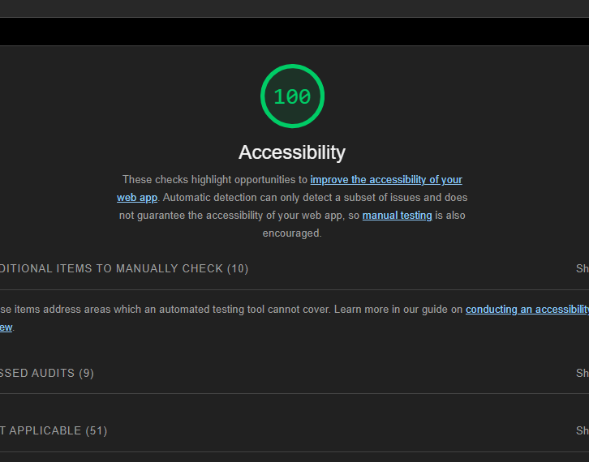
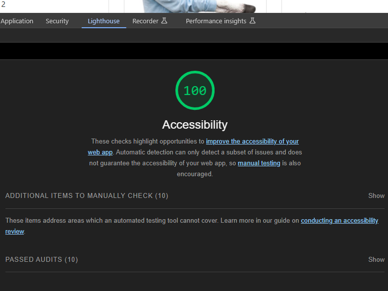

# Lab 01 Horned Beasts

Using react I render data on a page for the first time

## Accessibility Report

## Getting Started

### Requirements

For development, you will only need [Node](http://nodejs.org/) installed in your environment.
Please use the appropriate [Editorconfig](http://editorconfig.org/) plugin for your Editor (not mandatory).

### Install

    git clone https://github.com/ORG/PROJECT.git
    cd PROJECT
    npm install

### Configure app

Any environment configuration steps.

### Start & watch

    npm run dev
    npm start

### Simple build for production

    npm run build

## Architecture

Describe how the project is structured.

### Languages & tools

Explain what tools are used.

## Change Log

List versioned releases.

## Collaborators

List collaborators here.

## Time Estimate 

### Lab 02

- Number and name of feature: Lab 02 

- Estimate of time needed to complete: 4hrs

- Start time: 5:29pm CST

- Finish time: 8:26pm CST

- Actual time needed to complete: 2hrs57min

### Lab 03 

Number and name of feature: Lab 03

Estimate of time needed to complete: 4

Start time: 4:33pm CST

Finish time: 10:30pm CST

Actual time needed to complete: 6hrs

### Lab 04

Number and name of feature: Lab 04

Estimate of time needed to complete: 5

Start time: 4:45pm CST

Finish time: 9pm CST

Actual time needed to complete: 4:15